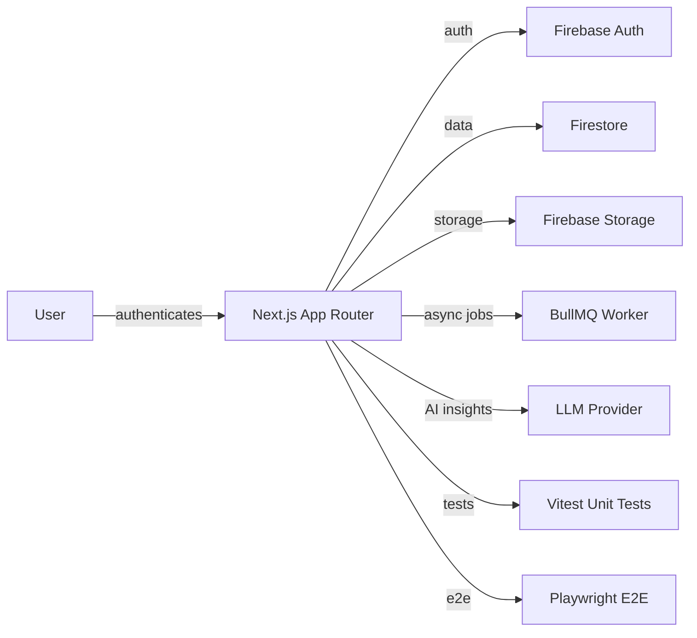
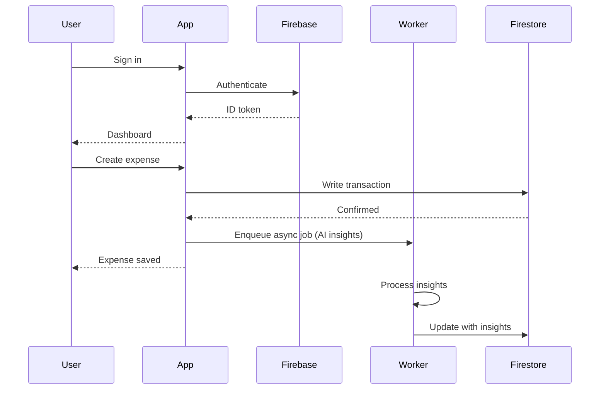

# Saveflow

AI-powered finance automation platform. Next.js 15 + Firebase app for expense tracking, budget management, and AI-driven financial insights.

## Overview

Personal finance platform combining expense tracking, budget management, and AI-powered financial insights. Built with Next.js 15, Firebase Auth and Firestore, Tailwind CSS v4, and Vitest for testing. Supports Playwright E2E and includes a BullMQ worker for async processing.

## Core Architecture



## System Components

| Component | Responsibility |
|-----------|---------------|
| `src/app/` | Next.js App Router pages and layouts |
| `src/components/` | React UI components |
| `src/lib/` | Firebase client/server utilities, business logic |
| `worker/` | BullMQ async job processing |
| `tests/` | Vitest unit and integration tests |
| `docs/` | Project documentation |

## Repository Layout

| Directory | Purpose |
|-----------|---------|
| `src/app/` | Next.js routes (App Router) |
| `src/components/` | React components |
| `src/lib/` | Utilities (Firebase, business logic) |
| `worker/` | Background job processing |
| `tests/` | Unit and integration tests |
| `docs/` | Documentation |

## Technology Stack

| Layer | Technology | Purpose |
|-------|-----------|---------|
| Framework | Next.js 15 (App Router) | Full-stack React framework |
| Language | TypeScript | Type safety |
| Styling | Tailwind CSS v4 | Utility-first CSS |
| Auth | Firebase Auth | Authentication |
| Database | Firestore | NoSQL data store |
| Storage | Firebase Storage | File storage |
| Queue | BullMQ + Redis | Async job processing |
| Testing | Vitest + Playwright | Unit and E2E testing |
| Validation | Zod | Schema validation |

## Requirements

- Node.js 18+
- npm
- Firebase project

## Configuration

| File | Purpose |
|------|---------|
| `.env.example` | Environment variable template |
| `firebase.json` | Firebase hosting and Firestore config |
| `firestore.rules` | Firestore security rules |
| `firestore.indexes.json` | Firestore composite indexes |
| `storage.rules` | Storage security rules |
| `next.config.ts` | Next.js configuration |
| `vitest.config.mts` | Vitest configuration |
| `playwright.config.ts` | Playwright E2E configuration |

## Getting Started

```bash
git clone <repo-url>
cd Saveflow
npm install
cp .env.example .env.local
# Configure Firebase credentials in .env.local
npm run dev
```

Open http://localhost:3000

## Development

```bash
npm run dev         # Start Next.js dev server
npm run build       # Production build
npm run lint        # ESLint check
npm run test        # Run Vitest suite
npm run test:e2e    # Run Playwright E2E
npm run worker      # Start BullMQ worker
```

## Request / Data Flow


